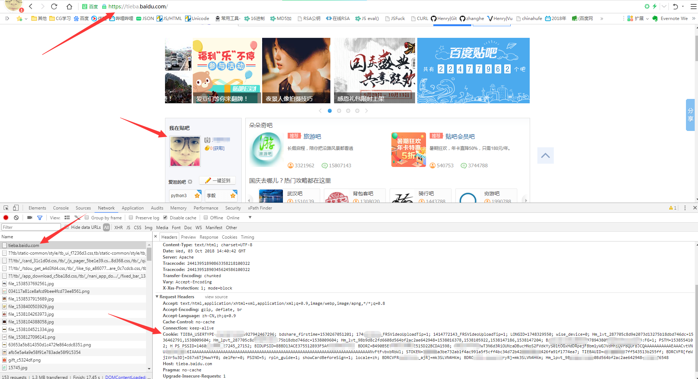
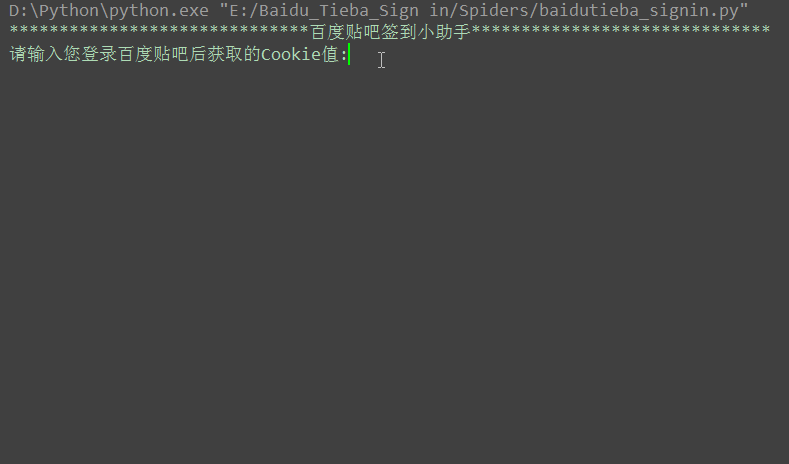

百度贴吧实现一键签到 
===========================
   
### 百度贴吧官网 - https://tieba.baidu.com/
|Author|:sunglasses:Henryhaohao:sunglasses:|
|---|---
|Email|:hearts:1073064953@qq.com:hearts:

    
****
## :dolphin:声明
### 软件均仅用于学习交流，请勿用于任何商业用途！感谢大家！
## :dolphin:介绍
### 该项目为Python实现[百度贴吧](https://tieba.baidu.com/)的一键签到
- 项目介绍:通过传入用户登录百度贴吧后得到的Cookie(可以登录后抓包获取)，即可自动实现该用户所有关注的贴吧一键签到
- 运行方式:运行Spiders目录下baidutieba_signin.py文件即可
## :dolphin:运行环境
Version: Python3
## :dolphin:安装依赖库
```
pip3 install -r requirements.txt
```
## :dolphin:运行截图
> - **如何获取登录后的Cookie**<br><br>


> - **运行过程**<br><br>



